> You have been kidnapped and dropped into a random warehouse.
> All you get is one look around and a map of the building with no colour on it.
> Can you tell where you are?

That was eternal.ag's challenge at TechQuest, a new two-week hackathon at IIT Patna. A robot is dropped somewhere in a building. You get one 360°
LiDAR sweep (a 32-beam laser scanner that returns a cloud of 3D points), one
camera frame, and a point cloud of the building with geometry only, no colour.
There's no GPS and no starting guess. You output the robot's full 6-DoF pose.

Each scenario is scored on translation error `e_t` and rotation error `e_r`:

```python
L = 0.7 * min(e_t / 2 m, 1) + 0.3 * min(e_r / 20°, 1)
score = 100 * (1 - mean L)
```

So an answer 2 m or more off in position earns nothing on that term, and an answer
within a few centimetres earns almost full marks. We also tracked SR@fine, the
fraction of scenarios within 0.5 m and 5°.

We had one development map: a 161 × 98 × 12 m warehouse with 40 scans and their
ground-truth poses. We call it dev.

From day one we bet that the hidden set would be the same warehouse with new poses, so we tuned for that warehouse and nothing else. With four days to go we scored 99.9 out of 100 on dev.

With two days to go, eternal.ag clarified that the eval map could be anything: a small room, a kilometres-long road with two dashed lines painted on it. We generated a few maps like that and ran the same code on them. On a 400 m dashed corridor it scored 1.22, which is WORSE than guessing at random (1.64).

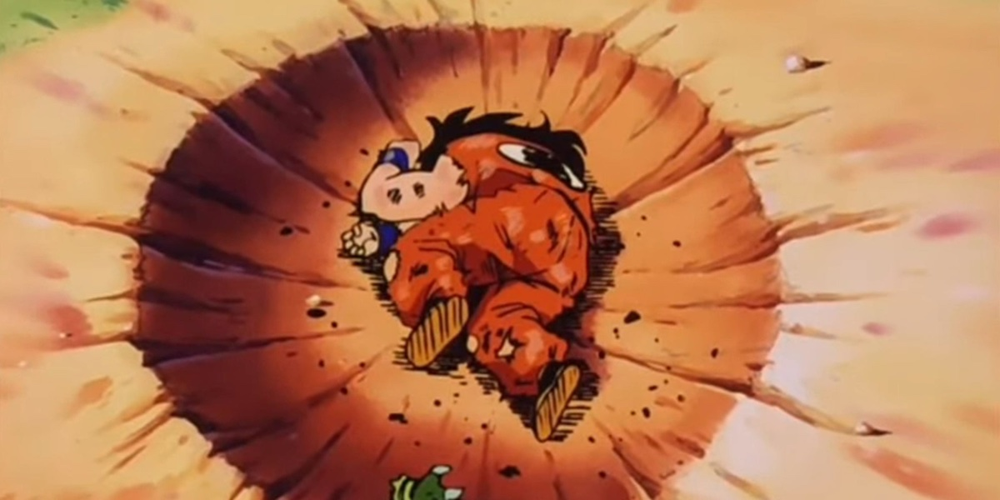

Every constant in our pipeline was a fact about that one warehouse. This post is about the two days we spent rebuilding the search so it measures those facts from whatever map it's given. Along the way we found that our own benchmark was flattering us by up to 87 points, and that most of our failures had a different cause from the one we'd been working on.

## Act I: getting very good at one warehouse

### How the baseline works

The baseline that came with the challenge treats localization as image matching. It cuts
the map into horizontal height bands (floor level, rack level, ceiling and so on)
and flattens each band into a top-down occupancy image. It does the same to the
scan, then slides the scan's images over the map's images at every position and
every heading and scores the overlap. An FFT makes that exhaustive search cheap.
The peaks of the resulting score surface are candidate poses, and the best one is
refined with ICP, which nudges the scan until its points sit on the map's
surfaces.

It scored 97.74 on dev, and missed exactly one scenario.

### The shelf in the wrong bay

On one scenario, number 14, the baseline got the heading right to 0.08° and the position
across the aisle right to 3 mm. It was 110 m off along the aisle: the racks repeat every 5 m, and it had picked the right shelf in the wrong bay.

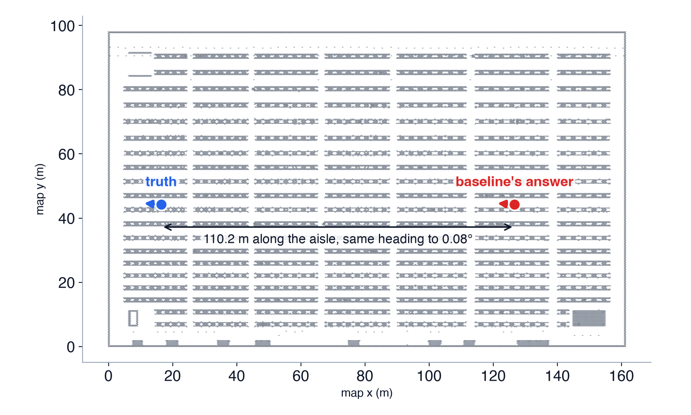

From the scan's point of view, those two places look the same at rack height. What
tells them apart is higher up. The ceiling lattice repeats every 8 m, which doesn't
line up with the 5 m racks, so the ceiling band sees a different pattern at the
two spots. The baseline gave the rack band (2.5 to 5 m) double weight. Dropping it
to the same weight as the others, `[1,1,1,2,2]` to `[1,1,1,1,2]`, let the ceiling
break the tie. That fixed scenario 14 and took dev to 99.51, 40 out of 40.

### Squeezing out the rest

With every scenario in the right place, the remaining error was all precision, so
the next gains came from refinement:

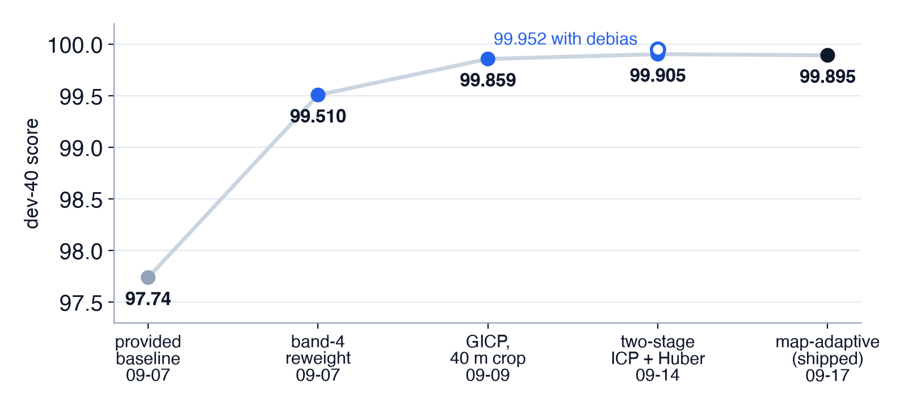

| days left | version | dev score | what moved it |
|---|---|---|---|
| 11 | provided baseline | 97.74 | starting point |
| 11 | rack band reweighted | 99.51 | fixes scenario 14 |
| 9 | GICP, 40 m crop | 99.86 | better registration |
| 4 | two-stage ICP + Huber loss | 99.905 (99.952 with the offset correction below) | refinement precision |

The refiner nudges the scan until it lines up with the map. We switched to a version (GICP) that treats walls and floors as flat surfaces, and had it only look at the map within 40 m of the robot. That's 99.86. A second, finer pass, plus a rule that stops a few bad matches from dragging the answer off, got us to 99.905.

### What didn't work


Our first instinct was that the camera would tell repeating aisles
apart. An edge-based re-ranker did pick the true pose 37 out of 40 times. But every
near-tie on dev was the same heading at a different position, and one camera with
no depth can't measure position against repeating structure. The LiDAR sees 360°
with 2 cm range noise, the camera sees 90° with no range, and the map has no colour
for pixels to match. We estimated that letting the camera decide close calls was
worth about −5 points, so it shipped switched off.

Coarse-to-fine search (a quick low-resolution pass, then a detailed one) was
faster but lost accuracy on two synthetic test sets.
On a closer look, 92.6% of the "architecture win" we had credited to it came from
switching to GICP at the same time.

Hedging didn't help either. The format lets you submit three weighted guesses per scenario.
Splitting the weight costs you every time your first guess is right, and ours was
right on all 40. We measured it anyway, and sending one pose is correct.

Yaw refinement helped on synthetic scans and cost 3.45 points on real scans
with half the view blocked. A hand-tuned change that drops the floor band, which we had expected to be
the fragile one, held up.

### The 3 mm that wasn't ours

At 99.9 the leftover error was 93% translation, and it had a strange pattern. Every
one of the 40 answers was shifted about +2.9 mm along the map's x axis. It showed
up in every configuration we had, including the untouched baseline. Subtracting it
was worth +0.05.

We spent more time on those 3 mm than on anything else. One at a time we ruled out
scan noise, grid resolution, surface normals, the robust loss, five ICP variants,
downsampling, map tilt and range scale. What settled it was starting the refiner exactly at the ground-truth pose. It walks 2.4 mm away, every time.

The map and the ground truth disagree by 2.4 mm. The best possible fit of a scan
against this map isn't at the true pose, so no registration method can score past
that on raw poses. Subtracting the offset looked defensible, since a quirk of the map would carry over to an evaluation on the same
map.


## The day the problem statement changed

Then, with two days to go, the clarification came. The eval map is anonymous, and it replaces the dev warehouse inside the code we submit. Our bet was wrong.

We measured what it cost that evening, with 30 synthetic poses per map:

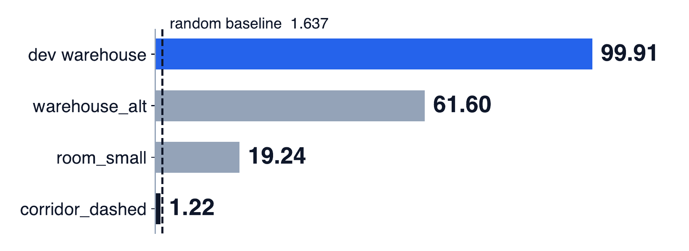

The second warehouse hurt most. It's the same kind of building with a different
rack pitch, and we lost 38 points on it.

### Every constant was a fact about dev

Every constant we checked was a measurement of dev:

- Band heights were fractions of the map's height. On dev that gives bands from
  0.12 to 10 m. In a 1.3 m corridor it gives bands from 1 cm to 1.1 m.
- The search window around the scan was capped by the map's narrow side. An 8 m
  wide corridor got a 3.2 m window, so a 70 m sensor threw away every return along
  the corridor.
- The suppression radius was 5.0 m, which is the dev rack pitch.
- The sensor height was fixed at 1.0 m.


## Act II: letting the map set the constants

We rebuilt the search so every constant is derived at runtime from the map and the
sensor it's handed. The code contains no map names, size classes or per-map
settings.

- Bands use fixed metre heights above a floor level estimated from the map.
- Band weights come from how repetitive each band is. We measure that with
  autocorrelation: shift the band's top-down image against itself and see how well
  it matches. A band that matches itself well at some offset (like racks every 5 m)
  is repetitive and gets less weight. A band that is nearly solid, such as a
  concrete floor slab or a roof deck, carries no position information and gets
  none.
- Grid resolution comes from the map's area under a memory budget.
- The suppression radius is the width of the correlation peak itself: 0.27 m on dev
  and 0.90 m in a curved tunnel. More on why that matters below.
- Sensor height is measured from each scan's own floor returns. That needs a
  guard, because at −15° the lowest beam first reaches the floor 3.7 m out. In a
  3 × 2.6 m room every downward beam hits a wall before it hits the floor.

The result we like most is on dev. With no dev tuning, the derived weights give the
2.5 to 5 m rack band the lowest weight and the ceiling one of the highest. That's
the same fix we found by hand for scenario 14 in week one, now coming out of a
measurement:

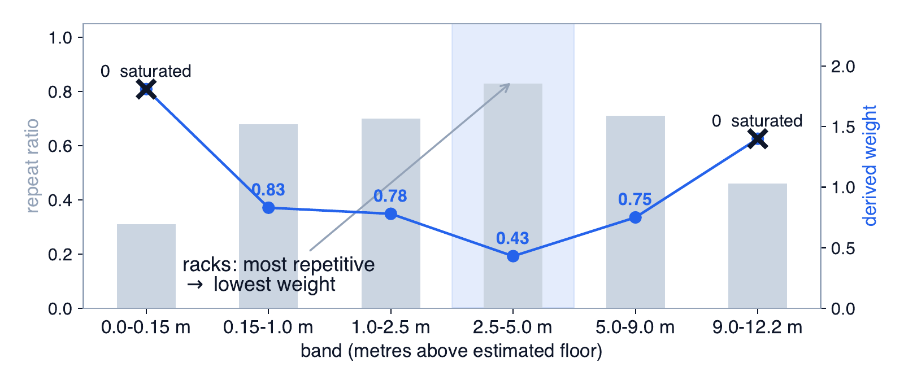

### Our own benchmark was lying to us

To develop on anything besides dev, we needed more maps. We wrote a generator for
18 test maps of different kinds (small rooms, an L-shaped room, an apartment, an office, a lab,
three corridors, a tunnel, a street, an open yard, a garage, an atrium, a sloped
floor and three warehouses) and rendered 30 LiDAR scans per map with known
ground truth.

The first results looked excellent. The open yard, a nearly empty paved area,
scored 91.

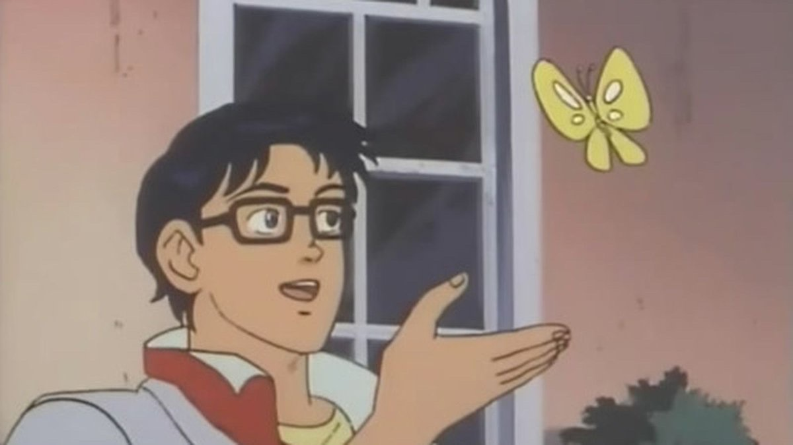

*How it feels to get lied to*


An empty yard should be hard. The 91 was fake. Our renderer cast the
synthetic scans against the same point cloud that we then handed to the localizer
as its map. A point cloud has random density: some cells have a few more points
than others. The scan inherited exactly that pattern, so scan and map shared a
fingerprint, and the correlation search matched the fingerprint instead of the
geometry.

We re-rendered every scan against an independent sampling of the same geometry,
changing nothing else. The yard fell from 91.4 to 3.9. The garage fell from
95.4 to 31.3.

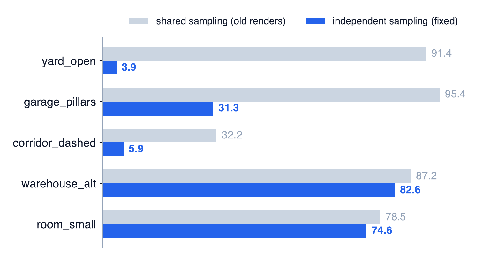

The effect is largest where the map has the least real structure, which is where a
fingerprint has the least competition. We threw out every synthetic number from
before the fix, and everything below is on the corrected benchmark. Dev was never
affected: its scans are real.

### Most failures happened before refinement

The search produces a shortlist of candidate poses, and later stages pick and
refine the best one. A failure can happen at three points: the true pose never
makes the shortlist, it makes the shortlist but loses the ranking, or it wins but
refinement lands it in the wrong spot. Candidate recall is the first one: does the
correct pose survive into the shortlist at all?

We sorted 355 failures on the corrected benchmark.

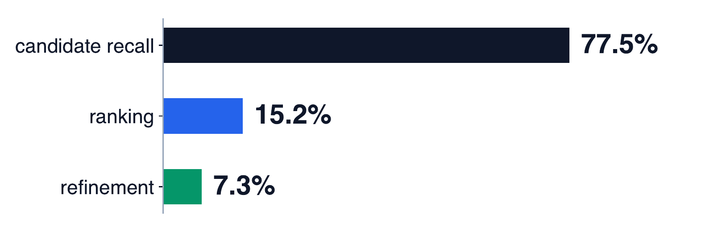

77.5% were recall failures. Most of Act I had gone into refinement and ranking,
and no amount of either can recover a pose that was never on the list.

So we scored the correlation surface directly at the ground-truth pose. The
truth was almost always a strong peak. In the curved tunnel, which scored 24.78 with
SR@fine 0.000, the true pose was among the top four peaks in every failing scan.
The search had found it, and then suppression deleted it.

After taking the best peak, the search blanks out
everything within a radius so the next candidate is a different place.
The first map-adaptive version set that radius to a tenth of the search window,
which is 7 m on any map scanned with a 70 m sensor. If a wrong peak scored slightly
higher and sat within 7 m of the truth, the truth was erased. In the tunnel, 66% of
recall failures sat inside another candidate's exclusion zone.

The fixes were:

- set the suppression radius from the width of the correlation peak itself;
- keep every true local peak instead of just the single highest cell and its neighbours;
- keep 128 candidates instead of 8;
- choose among them by inlier ratio: place the whole scan at each candidate pose
  and count the fraction of its points that land within a tight distance of the
  map.

The share of scenarios with the truth in the shortlist went from 0.496 to 0.668,
and the mean over the 18 unseen maps went from 47.21 to 56.56.

### The far returns decide the office map

The office map is a grid of thin partitions with desks scattered through it:

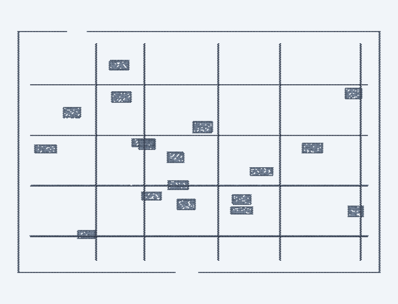

After the recall fixes, the truth was in the shortlist and we still picked the
wrong pose. When we compared the true pose and the wrong pose that won, on three
scenarios, the wrong pose had the higher inlier ratio every time (for example 0.918
against 0.822). Nearby, one office bay looks like the next, and the wrong pose
actually fit the nearby walls slightly better.

The far returns disagreed. Returns from the outer half of the search
window are only 0.3 to 0.7% of the scan, but at the truth none of them missed the map,
while at the wrong pose up to all of them did. An average over the whole scan
drowned that signal in near-field points that pointed the wrong way.

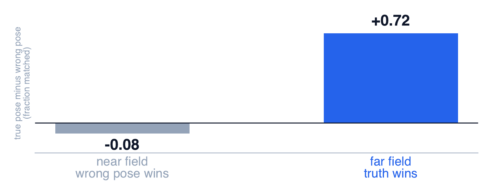

We made the final decision count only the far half of the search window, falling
back to the whole scan when there are fewer than 32 far returns. Together with a
different verification statistic and a few ICP iterations on every candidate
before comparing them, that took the office map from SR@fine 0.17 to
0.70.

## Where it ended up

| days left | version | 18 unseen maps (mean) | dev |
|---|---|---|---|
| 2 | dev-tuned version | 45.24 (on the corrected benchmark) | 99.91 |
| 1 | map-derived constants + candidate harvest | 56.56 | 99.89 |
| final day | + new verification statistic, refine every candidate | 61.02 | 99.89 |
| final day | + far-field check | 64.42 | 99.89 |

The dev submission stayed byte-identical from the day before the deadline on, which is our check that
the derived constants come from the map alone.

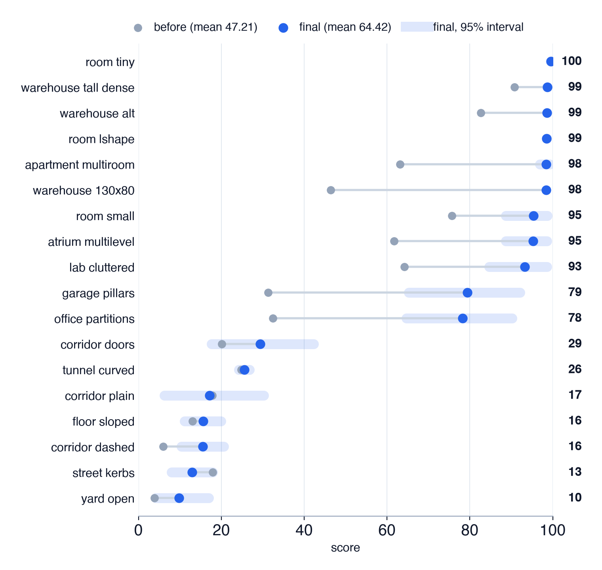

A note on sample size: each synthetic map has 30 poses (23 and 29 on the two
smallest rooms, where there isn't space for more). The intervals in the chart are
wide, especially in the middle of the range, so read the shape of the table rather
than the second decimal. The 130 × 80 m warehouse also came from a generator we
didn't write, so its scans still share the map's sampling and its 98.40 should be read as
an upper bound. Only the dev row is a real score; the synthetic maps are for
rejecting ideas.

For comparison, we ran the provided baseline, unmodified, on the same
benchmark. It still gets 97.74 on dev, averages 21.08 on the unseen maps, and falls
below random on the dashed corridor.

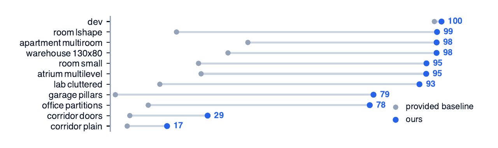

## What it cost, and what still fails

Dev went down, from 99.952 to 99.895. About 0.011 of that is the price of replacing
hand-tuned constants with measured ones. The other 0.047 is the offset correction. On an
unknown map the 2.4 mm offset doesn't correct anything; it just shifts every pose
by 2.4 mm, so we dropped it. We'd rather ship the lower dev number we can defend.

Five maps remain unsolved: the open yard, the dashed corridor, the street,
the curved tunnel and the sloped floor, scoring between 9.7 and 25.5, with SR@fine 0.000 on four of them and 0.033 on the yard.
For two of them the scans themselves are thin. Counting returns more than 0.15 m
above the floor, the median yard scan has 1,486 and the dashed corridor has 41,
against 30,878 in a warehouse.

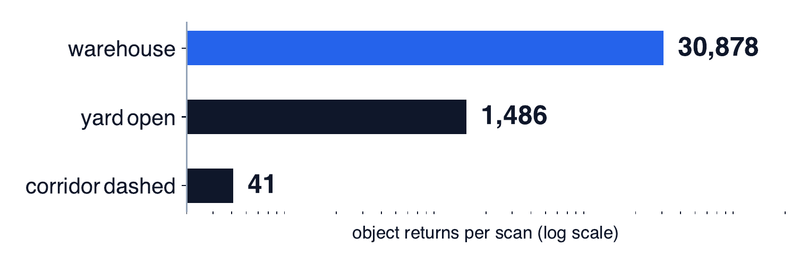

That doesn't prove those maps are impossible, and we only tested our own family of
methods. It does mean that the correlator, the ICP refiner and the camera are all
working from the same 41 points.

## So yeah

We spent two weeks getting really good at one warehouse, and then found out the test might not be a warehouse at all. Two days later the thing reads its constants off whatever map you hand it, went from 47 to 64 on maps it had never seen, and still gets lost in an empty yard.

If there's a lesson, it's to write down what you're betting on, and to try breaking your benchmark before you believe it.
